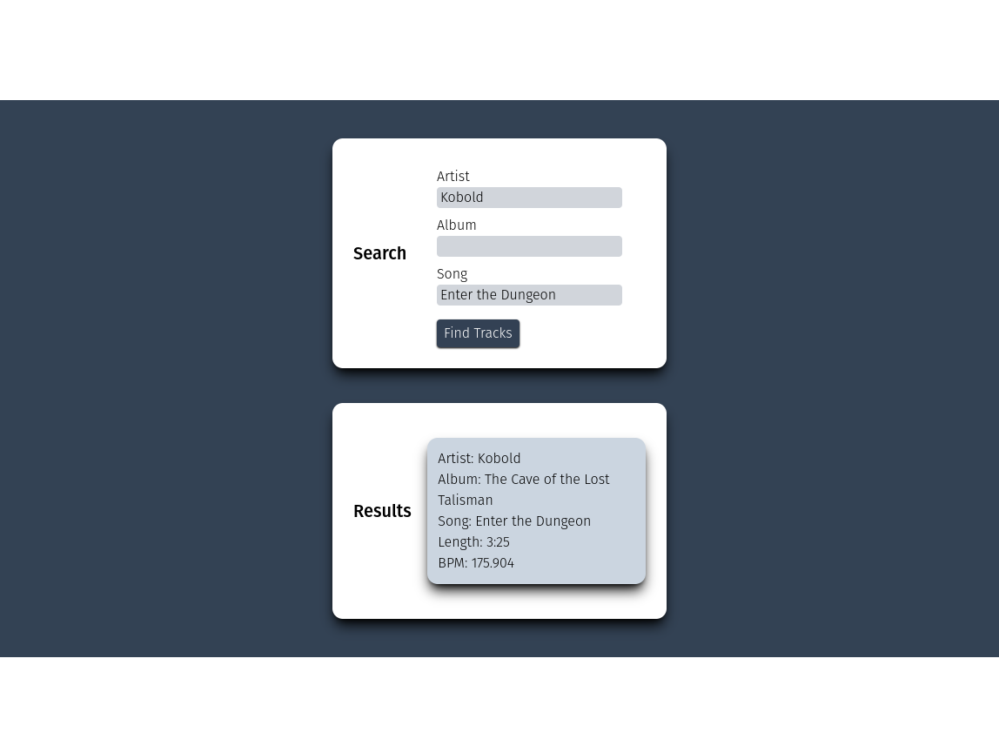

# Cadence Song BPM App
An app that utilizes the Spotify API to determine the BPM of a song.

## Description

I like to listen to music while I run, but I often find that the songs I'm playing are either too fast or too slow for my pace. So, I wrote this app to allow anyone to use the Spotify api to look up the BPM of any given song.

## Link
The app is live [HERE](https://cadence.onrender.com/).

## Usage

You can search by artist, album, song, or any combination thereof.

## Support
If you have any questions about the app or suggestions, please send me an email at tim.loughrist@gmail.com.

## Roadmap
Ideally, you'd be able to search by BPM, but the Spotify api doesn't have an endpoint for that yet.

## Contributing
If anyone wants to fork this repo and work on the app, I'd love to see what you do with it!